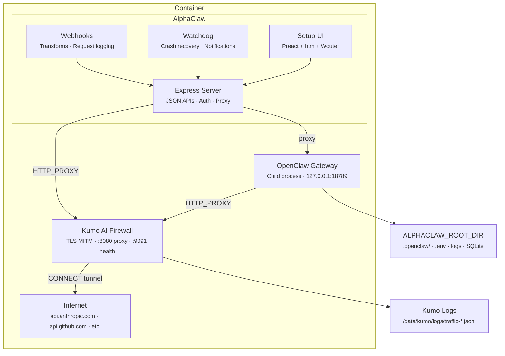

<p align="center">
  
</p>
<h1 align="center">AlphaClaw</h1>
<p align="center">
  <strong>The ultimate OpenClaw harness. Deploy in minutes. Stay running for months.</strong><br>
  <strong>Observability. Reliability. Network security. Zero SSH rescue missions.</strong>
</p>

<p align="center">
  <a href="https://github.com/chrysb/alphaclaw/actions/workflows/ci.yml"></a>
  <a href="https://www.npmjs.com/package/@chrysb/alphaclaw"></a>
  <a href="LICENSE"></a>
</p>

<p align="center">AlphaClaw wraps <a href="https://github.com/openclaw/openclaw">OpenClaw</a> with a convenient setup wizard, self-healing watchdog, Git-backed rollback, and full browser-based observability. This fork bundles <a href="https://github.com/kumo-ai/kumo">Kumo</a>, a TLS-intercepting AI firewall proxy, so every outbound HTTP request your agent makes is observable and controllable from the first second. Ships with anti-drift prompt hardening, simplified integrations (Google Workspace, Telegram, Slack, Discord), and zero-config network security.</p>

<p align="center"><em>OpenClaw, but safe. First deploy to first message in under five minutes.</em></p>

<p align="center">
  <a href="https://railway.com/deploy?repo=https://github.com/garrytan/alphaclaw"></a>
  <a href="https://render.com/deploy?repo=https://github.com/garrytan/alphaclaw"></a>
</p>

> **Platform:** AlphaClaw currently targets Docker/Linux deployments. macOS local development is not yet supported.

## Features

- **Kumo AI Firewall:** Built-in TLS-intercepting proxy that observes and controls all outbound HTTP traffic. See every API call your agent makes. Block dangerous operations. Zero config, observe mode by default.
- **Setup UI:** Password-protected web dashboard for onboarding, configuration, and day-to-day management.
- **Guided Onboarding:** Step-by-step setup wizard — model selection, provider credentials, GitHub repo, channel pairing.
- **Multi-Agent Management:** Sidebar-driven agent navigation with create, rename, and delete flows. Per-agent overview cards, channel bindings, and URL-driven agent selection.
- **Gateway Manager:** Spawns, monitors, restarts, and proxies the OpenClaw gateway as a managed child process.
- **Watchdog:** Crash detection, crash-loop recovery, auto-repair (`openclaw doctor --fix`), Telegram/Discord/Slack notifications, and a live interactive terminal for monitoring gateway output directly from the browser.
- **Channel Orchestration:** Telegram, Discord, and Slack bot pairing with per-agent channel bindings, credential sync, and a guided wizard for splitting Telegram into multi-threaded topic groups as your usage grows.
- **Google Workspace:** OAuth integration for Gmail, Calendar, Drive, Docs, Sheets, Tasks, Contacts, and Meet, plus guided Gmail watch setup with Google Pub/Sub topic, subscription, and push endpoint handling.
- **Cron Jobs:** Dedicated cron tab with job management, an interactive rolling calendar, run-history drilldowns, trend analytics, and per-run usage breakdowns.
- **Nodes:** Guided local-node setup for VPS deployments with per-node browser attach checks, reconnect commands, and routing/pairing controls.
- **Webhooks:** Named webhook endpoints with per-hook transform modules, request logging, payload inspection, editable delivery destinations, and OAuth callback support for third-party auth flows.
- **File Explorer:** Browser-based workspace explorer with file visibility, inline edits, diff view, and Git-aware sync for quick fixes without SSH.
- **Prompt Hardening:** Ships anti-drift bootstrap prompts (`AGENTS.md`, `TOOLS.md`) injected into your agent's system prompt on every message — enforcing safe practices, commit discipline, and change summaries out of the box.
- **Git Sync:** Automatic hourly commits of your OpenClaw workspace to GitHub with configurable cron schedule. Combined with prompt hardening, every agent action is version-controlled and auditable.
- **Version Management:** In-place updates for both AlphaClaw and OpenClaw with in-app release notes, changelog review, and one-click apply.
- **Codex OAuth:** Built-in PKCE flow for OpenAI Codex CLI model access.

## Why AlphaClaw

- **Zero to production in one deploy:** Railway/Render templates ship a complete stack — no manual gateway setup.
- **Self-healing:** Watchdog detects crashes, enters repair mode, relaunches the gateway, and notifies you.
- **Everything in the browser:** No SSH, no config files to hand-edit, no CLI required after first deploy.
- **Stays out of the way:** AlphaClaw manages infrastructure; OpenClaw handles the AI.

## No Lock-in. Eject Anytime.

AlphaClaw simply wraps OpenClaw, it's not a dependency. Remove AlphaClaw and your agent keeps running. Nothing proprietary, nothing to migrate.

## Quick Start

### Deploy (recommended)

[](https://railway.com/deploy?repo=https://github.com/garrytan/alphaclaw)
[](https://render.com/deploy?repo=https://github.com/garrytan/alphaclaw)

Set `SETUP_PASSWORD` and `ANTHROPIC_API_KEY` at deploy time and visit your deployment URL. Kumo starts automatically in observe mode. The welcome wizard handles the rest.

> **Railway users:** after deploying, upgrade to the **Hobby plan** and redeploy to ensure your service has at least **8 GB of RAM**. The Trial plan's memory limit can cause out-of-memory crashes during normal operation.

### Local / Docker

This fork includes a Dockerfile that bundles Kumo (AI firewall) with AlphaClaw:

```bash
git clone https://github.com/garrytan/alphaclaw.git
cd alphaclaw
docker build -t alphaclaw .
docker run -p 3000:3000 -p 9091:9091 -v alphaclaw-data:/data \
  -e SETUP_PASSWORD=your-password \
  -e ANTHROPIC_API_KEY=sk-ant-... \
  alphaclaw
```

Or with Docker Compose (recommended):

```bash
# Copy .env.example to .env and fill in your API keys
docker compose up
```

Visit `http://localhost:3000` for the setup wizard. Kumo starts automatically in observe mode, logging all outbound traffic to `/data/kumo/logs/`.

### Without Docker

```bash
npm install @chrysb/alphaclaw
npx alphaclaw start
```

Note: Running without Docker skips the Kumo integration. Use Docker for the full secured experience.

## Setup UI

| Tab           | What it manages                                                                                                          |
| ------------- | ------------------------------------------------------------------------------------------------------------------------ |
| **General**   | Gateway status, channel health, pending pairings, Google Workspace, repo sync schedule, OpenClaw dashboard               |
| **Browse**    | File explorer for workspace visibility, inline edits, diff review, and Git-backed sync                                   |
| **Usage**     | Token summaries, per-session and per-agent cost and token breakdown with source/agent dimension comparisons              |
| **Cron**      | Cron job management, interactive rolling calendar, run-history drilldowns, trend analytics, and per-run usage breakdowns |
| **Nodes**     | Guided local-node setup for VPS deployments, per-node browser attach, reconnect commands, and routing/pairing controls   |
| **Watchdog**  | Health monitoring, crash-loop status, auto-repair toggle, notifications, event log, live log tail, interactive terminal  |
| **Providers** | AI provider credentials (Anthropic, OpenAI, Gemini, Mistral, Voyage, Groq, Deepgram) and model selection                 |
| **Envars**    | Environment variables — view, edit, add — with gateway restart prompts                                                   |
| **Webhooks**  | Webhook endpoints, transform modules, request history, payload inspection, OAuth callbacks, Gmail watch delivery flows   |

## CLI

| Command                                                    | Description                                   |
| ---------------------------------------------------------- | --------------------------------------------- |
| `alphaclaw start`                                          | Start the server (Setup UI + gateway manager) |
| `alphaclaw git-sync -m "message"`                          | Commit and push the OpenClaw workspace        |
| `alphaclaw telegram topic add --thread <id> --name <text>` | Register a Telegram topic mapping             |
| `alphaclaw version`                                        | Print version                                 |
| `alphaclaw help`                                           | Show help                                     |

## Architecture



All outbound HTTP traffic from both AlphaClaw (Node.js) and the OpenClaw gateway (Go) routes through Kumo. Local traffic (127.0.0.1) bypasses the proxy via `NO_PROXY`.

## Watchdog

The built-in watchdog monitors gateway health and recovers from failures automatically.

| Capability               | Details                                                                |
| ------------------------ | ---------------------------------------------------------------------- |
| **Health checks**        | Periodic `openclaw health` with configurable interval                  |
| **Crash detection**      | Listens for gateway exit events                                        |
| **Crash-loop detection** | Threshold-based (default: 3 crashes in 300s)                           |
| **Auto-repair**          | Runs `openclaw doctor --fix --yes`, relaunches gateway                 |
| **Notifications**        | Telegram, Discord, and Slack alerts for crashes, repairs, and recovery |
| **Event log**            | SQLite-backed incident history with API and UI access                  |

## Kumo AI Firewall

This fork bundles [Kumo](https://github.com/kumo-ai/kumo), a TLS-intercepting HTTP proxy that sits between your agent and the internet. Every outbound request is visible. You decide what's allowed.

### How It Works

Kumo runs as a background process inside the same container. The entrypoint script:

1. Generates a CA certificate (first run only, persisted across restarts)
2. Trusts the CA in the system store and Node.js
3. Sets `HTTP_PROXY` / `HTTPS_PROXY` so all outbound traffic routes through Kumo
4. Starts `kumo serve` in observe mode
5. Waits for Kumo's health check, then starts AlphaClaw

Your agent doesn't know Kumo exists. It just sees `HTTP_PROXY` is set.

### What You Get

- **Traffic logs:** Every outbound HTTP request is logged to `/data/kumo/logs/traffic-YYYY-MM-DD.jsonl` with method, URL, headers, response status, timing, and the policy decision.
- **Policy engine:** YAML rules that allow, block, or flag requests by host, method, and path. The default policy (`templates/alphaclaw.yaml`) allows known APIs (Anthropic, OpenAI, GitHub, Telegram, Slack, Google) and blocks destructive operations (repo deletion, admin APIs).
- **Two modes:**
  - `observe` (default): Log everything, block nothing. See what your agent does.
  - `enforce`: Apply the policy. Blocked requests get a 403.

### Security Tiers

| Tier | How it works | Bypass risk | Use case |
|------|-------------|-------------|----------|
| **1.5 (default)** | Same container, proxy env vars | Agent could unset vars (needs root) | Railway, Render, generic Docker |
| **2** | Separate containers, iptables | Agent cannot bypass (kernel-level) | Fly.io Sprites, self-hosted Docker |

Tier 1.5 is the default because AlphaClaw is designed as a single-container app. For kernel-level enforcement, use `docker-compose.tier2.yml`.

### Configuration

| Variable | Default | Description |
|----------|---------|-------------|
| `KUMO_ENABLED` | `true` | Set `false` to skip Kumo entirely |
| `KUMO_MODE` | `observe` | `observe` (log only) or `enforce` (apply policy) |
| `KUMO_POLICY_PATH` | _(none)_ | Path to policy YAML (required in enforce mode) |
| `KUMO_DATA_DIR` | `/data/kumo` | Where CA certs, config, and traffic logs are stored |

### Viewing Traffic

Traffic logs are JSONL files at `/data/kumo/logs/traffic-YYYY-MM-DD.jsonl`. Each line is one request:

```json
{
  "ts": "2026-04-04T14:30:45Z",
  "method": "POST",
  "url": "https://api.anthropic.com/v1/messages",
  "host": "api.anthropic.com",
  "response_status": 200,
  "duration_ms": 1245,
  "decision": "allow",
  "decision_reason": "fast_rule:allow_anthropic"
}
```

Inside the container, you can use Kumo's TUI dashboard:

```bash
docker exec -it <container> kumo tui --data-dir /data/kumo
```

### Switching to Enforce Mode

1. Review traffic logs to understand your agent's network behavior
2. Customize the policy at `templates/alphaclaw.yaml` (or create your own)
3. Set `KUMO_MODE=enforce` and `KUMO_POLICY_PATH=/etc/kumo/templates/alphaclaw.yaml`
4. Restart the container

In enforce mode, requests matching a `block` rule get a 403 response. After 3 violations of the same rule, the agent is temporarily banned (1 hour by default).

### Tier 2: Kernel-Level Enforcement

For production deployments where you need real containment (not just proxy env vars):

```bash
docker compose -f docker-compose.tier2.yml up
```

This runs Kumo in a separate sovereign container. iptables rules in the AlphaClaw container block all outbound traffic except DNS and Kumo. Even if the agent compromises the container, it cannot reach the internet directly.

Requires Docker with iptables support (Fly.io Sprites, self-hosted Docker, Kubernetes). Does not work on Render or Railway.

### Fly.io Deployment

This fork includes `fly.toml` for Fly.io Sprites deployment:

```bash
fly launch                    # Creates the app from fly.toml
fly secrets set SETUP_PASSWORD=your-password ANTHROPIC_API_KEY=sk-ant-...
fly deploy
```

Sprites are persistent Linux microVMs with auto-sleep (~$3-5/month when active). Full VM means iptables works natively for Tier 2 enforcement.

## Troubleshooting

### Quick Checks

```bash
# Is Kumo running?
docker exec <container> kumo-doctor

# What's in the traffic logs?
docker exec <container> tail -5 /data/kumo/logs/traffic-$(date +%Y-%m-%d).jsonl

# Is the health endpoint up?
curl http://localhost:9091/healthz
```

### Common Issues

| Symptom | Cause | Fix |
|---------|-------|-----|
| Container starts but agents fail | Kumo crashed, all outbound fails | Check logs for `[semarang] ERROR`. Restart, or set `KUMO_ENABLED=false` |
| TLS certificate errors | CA trust not set up correctly | Run `kumo-doctor` inside the container. Check `NODE_EXTRA_CA_CERTS` |
| All API calls return 403 | Policy blocking in enforce mode | Switch to `KUMO_MODE=observe` or fix the policy |
| No traffic in logs | Proxy not intercepting | Check `HTTP_PROXY` env var. Run `kumo-doctor` |
| Container hangs on startup | Kumo taking too long to start | Check resources (memory, CPU). Kumo needs ~20MB RAM |

### kumo-doctor

A diagnostic script bundled in the Docker image. Checks 12 health dimensions and reports PASS/FAIL/WARN with actionable hints:

```bash
docker exec <container> kumo-doctor
```

```
=== Kumo Doctor ===
[PASS] Kumo process: running (PID 42)
[PASS] Kumo health: ok
[PASS] CA certificate: valid (expires Apr  4 21:30:00 2036 GMT)
[PASS] CA trusted (system): installed
[PASS] CA trusted (Node): NODE_EXTRA_CA_CERTS=/data/kumo/ca.pem
[PASS] SSL_CERT_FILE: not set (correct)
[PASS] Proxy: HTTP_PROXY=http://127.0.0.1:8080
[PASS] proxy-bootstrap.js: loaded via NODE_OPTIONS
[PASS] Traffic logs: 847 entries today
[PASS] Outbound test: HTTPS request through proxy succeeded
[INFO] KUMO_MODE=observe
[INFO] KUMO_ENABLED=true

=== Summary ===
  PASS: 10  FAIL: 0  WARN: 0
  STATUS: HEALTHY
```

### /kumo-doctor GStack Skill

If you use Claude Code with GStack, the `/kumo-doctor` skill automates troubleshooting across deployment platforms. It can:

- Read container logs and parse `[semarang]` startup messages
- Run `kumo-doctor` inside the container via `fly ssh console` or `docker exec`
- Check traffic logs for blocked requests or error patterns
- Use GStack browser to log into Render, Fly.io, or Railway admin panels to check deployment status, environment variables, and resource usage
- Diagnose common failure patterns and suggest specific fixes

```
/kumo-doctor
```

Works with Fly.io, Render, Railway, and generic Docker deployments.

### Disabling Kumo

If you need to run AlphaClaw without Kumo (debugging, testing, or if Kumo is causing issues):

```bash
# Set the environment variable
KUMO_ENABLED=false

# Or in docker-compose.yml:
environment:
  - KUMO_ENABLED=false
```

The entrypoint skips all Kumo setup (no CA, no proxy, no env vars) and starts AlphaClaw directly.

## Environment Variables

| Variable                          | Required | Description                                        |
| --------------------------------- | -------- | -------------------------------------------------- |
| `SETUP_PASSWORD`                  | Yes      | Password for the Setup UI                          |
| `OPENCLAW_GATEWAY_TOKEN`          | Auto     | Gateway auth token (auto-generated if unset)       |
| `GITHUB_TOKEN`                    | Yes      | GitHub PAT for workspace repo                      |
| `GITHUB_WORKSPACE_REPO`           | Yes      | GitHub repo for workspace sync (e.g. `owner/repo`) |
| `TELEGRAM_BOT_TOKEN`              | Optional | Telegram bot token                                 |
| `DISCORD_BOT_TOKEN`               | Optional | Discord bot token                                  |
| `SLACK_BOT_TOKEN`                 | Optional | Slack bot token (Socket Mode)                      |
| `WATCHDOG_AUTO_REPAIR`            | Optional | Enable auto-repair on crash (`true`/`false`)       |
| `WATCHDOG_NOTIFICATIONS_DISABLED` | Optional | Disable watchdog notifications (`true`/`false`)    |
| `PORT`                            | Optional | Server port (default `3000`)                       |
| `ALPHACLAW_ROOT_DIR`              | Optional | Data directory (default `/data`)                   |
| `TRUST_PROXY_HOPS`                | Optional | Trust proxy hop count for correct client IP        |
| `KUMO_ENABLED`                    | Optional | Enable/disable Kumo proxy (default `true`)         |
| `KUMO_MODE`                       | Optional | `observe` (log only) or `enforce` (apply policy)   |
| `KUMO_POLICY_PATH`               | Optional | Path to Kumo policy YAML (required in enforce)     |
| `KUMO_DATA_DIR`                   | Optional | Kumo data directory (default `/data/kumo`)         |

## Security Notes

AlphaClaw is a convenience wrapper — it intentionally trades some of OpenClaw's default hardening for ease of setup. You should understand what's different:

| Area                    | What AlphaClaw does                                                                                                                   | Trade-off                                                                                              |
| ----------------------- | ------------------------------------------------------------------------------------------------------------------------------------- | ------------------------------------------------------------------------------------------------------ |
| **Setup password**      | All gateway access is gated behind a single `SETUP_PASSWORD`. Brute-force protection is built in (exponential backoff lockout).       | Simpler than OpenClaw's pairing code flow, but the password must be strong.                            |
| **One-click pairing**   | Channel pairings (Telegram/Discord/Slack) can be approved from the Setup UI instead of the CLI.                                       | No terminal access required, but anyone with the setup password can approve pairings.                  |
| **Auto CLI approval**   | The first CLI device pairing is auto-approved so you can connect without a second screen. Subsequent requests appear in the UI.       | Removes the manual pairing step for the initial CLI connection.                                        |
| **Query-string tokens** | Webhook URLs support `?token=<WEBHOOK_TOKEN>` for providers that don't support `Authorization` headers. Warnings are shown in the UI. | Tokens may appear in server logs and referrer headers. Use header auth when your provider supports it. |
| **Gateway token**       | `OPENCLAW_GATEWAY_TOKEN` is auto-generated and injected into the environment so the proxy can authenticate with the gateway.          | The token lives in the `.env` file on the server — standard for managed deployments but worth noting.  |
| **Kumo CA key**         | The Kumo CA private key at `/data/kumo/ca-key.pem` is restricted to mode 0600. It stays inside the container.                         | In Tier 1.5 (same container), a root-level compromise could access it. Use Tier 2 for real containment. |
| **Kumo proxy**          | All outbound HTTP routes through Kumo via `HTTP_PROXY`. In Tier 1.5, a compromised agent could unset the env var.                     | Tier 1.5 provides visibility and deterrence, not containment. Tier 2 (iptables) provides containment.  |

If you need OpenClaw's full security posture (manual pairing codes, no query-string tokens, no auto-approval), use OpenClaw directly without AlphaClaw.

## Development

```bash
npm install
npm run build:ui        # Generate Setup UI bundle, Tailwind CSS, and vendor CSS (required for local runs from a git checkout)
npm test                # Full suite (440 tests)
npm run test:watchdog   # Watchdog-focused suite (14 tests)
npm run test:watch      # Watch mode
npm run test:coverage   # Coverage report
```

### Testing the Docker image

```bash
docker build -t alphaclaw-test .                                    # Build the full image (~2-5 min)
docker run --rm alphaclaw-test /bin/sh /app/smoke-test.sh           # Run integration tests
docker run --rm -e SETUP_PASSWORD=test alphaclaw-test kumo-doctor   # Run diagnostics
```

**Requirements:** Node.js >= 22.14.0, Docker (for Kumo integration testing)

## License

MIT
